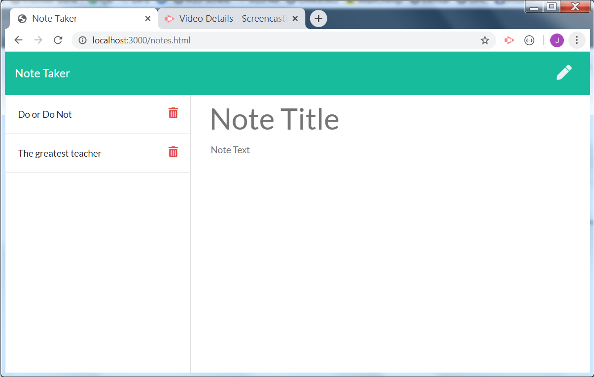

# NoteTaker

This node app uses express to send and receive data between the server and the front-end.  It allows a user to write, save and delete notes to/from a JSON database.

Click here for a video demonstration:

https://drive.google.com/file/d/1kOJoexPNhZw57vt60tQTVXSsWoYV5vKm/view

Here is a screen shot of the app:

